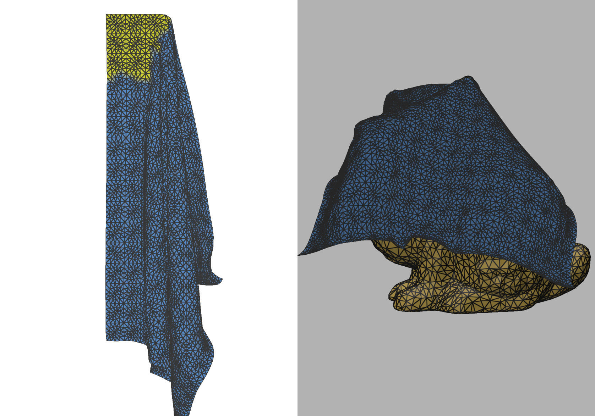

# Silk Physics



WIP C++17 cloth physics library with continuous collision detection and a GUI demo.

- Projective Dynamics–based cloth solver
- Self/obstacle collisions with tight-inclusion CCD
- GUI demo built with Polyscope (mesh IO: OBJ/OFF/PLY/STL)

Most third‑party dependencies are downloaded automatically by CMake. You still need a BLAS/LAPACK implementation and an OpenMP-enabled compiler installed on your system.

## Quick Start

### Prerequisites

- C++17 compiler with OpenMP
  - GCC ≥ 9, Clang/AppleClang ≥ 10
  - Windows: MSVC (VS 2022 17.2+ with `/openmp:llvm`) or clang-cl + LLVM OpenMP
- CMake ≥ 3.24 and a build tool (Ninja or Make)
- Git
- BLAS + LAPACK (e.g., OpenBLAS or Apple Accelerate)

Install BLAS/LAPACK examples:

- Ubuntu/Debian: `sudo apt install libopenblas-dev`
- Fedora: `sudo dnf install openblas-devel`
- macOS: `brew install openblas` (or use the system Accelerate framework)

### Clone, Configure, Build, Run

```bash
git clone https://github.com/iiiian/silk_physics.git
cd silk_physics
git submodule update --init --recursive

# Configure (downloads most deps automatically on first run)
cmake --preset release

# Build the demo
cmake --build build/release --target demo -j

# Run the demo (optional path to a model)
./build/release/demo/demo ./model/dense_sheet.obj
```

### CMake Options

- `-DSILK_BUILD_DEMO=ON|OFF` (default ON)
- `-DSILK_BUILD_TEST=ON|OFF` (default ON; requires Alembic)
- Optional BLAS picker: `-DBLA_VENDOR=OpenBLAS|Apple|Intel10_64lp|Generic`

## Demo Basics


Load cloth or obstacle using the scene widget on the top left. Supported 3D model formats are: `.obj`, `.off`, `.ply`, `.stl`. 

- Normal mode: Left-drag rotate, Right-drag pan (Polyscope defaults)
- Paint mode: Left-click paint pins, Right-click erase; adjustable radius
- Sim mode: Left-drag rotate, Right-drag pan, Ctrl + Left-drag to move pins/obstacles

Panels
- Scene: Load/Remove objects; object list
- Object Settings: Cloth/collision parameters, pin painting
- Simulation Settings: FPS (timestep), gravity/acceleration, solver iterations
- Statistics: FPS, vertex/face counts

## Using Silk as a Library

### Install and Integrate

```bash
cmake --build build/release --target install
```

In your project CMakeLists:

```cmake
cmake_minimum_required(VERSION 3.24)
project(myapp CXX)
find_package(silk REQUIRED)
add_executable(myapp main.cpp)
target_link_libraries(myapp PRIVATE silk::silk)
```

### Minimal Example

```cpp
#include <silk/silk.hpp>
#include <iostream>
#include <vector>

int main() {
  silk::World world;

  // Configure simulation (60 FPS, gravity -9.81 m/s^2)
  silk::GlobalConfig cfg;
  cfg.dt = 1.0f / 60.0f;
  cfg.acceleration_z = -9.81f;
  silk::Result r = world.set_global_config(cfg); 
  if (!r) {
    std::cerr << r.to_string() << "\n";
    return 1;
  }

  // A tiny quad (4 verts, 2 tris) in the XY plane
  std::vector<float> verts = {
      0.f, 0.f, 0.f,
      1.f, 0.f, 0.f,
      0.f, 1.f, 0.f,
      1.f, 1.f, 0.f,
  };
  std::vector<int>   faces = {0, 1, 2, 2, 1, 3};
    
  silk::MeshConfig mesh{verts, faces};
  silk::ClothConfig     cloth_cfg{};
  silk::CollisionConfig coll_cfg{};
  std::vector<int>      pins = {0}; // pin vertex 0

  uint32_t cloth_handle;
  r = world.add_cloth(cloth_cfg, coll_cfg, mesh, pin, cloth_handle);
  if (!r) {
    std::cerr << r.to_string() << "\n";
    return 1;
  }

  // Step the simulation
  r = world.solver_step();
  if (!r) {
    std::cerr << r.to_string() << "\n";
    return 1;
  }

  // Read new positions back to verts
  r = world.get_cloth_position(cloth_handle, verts);
  if (!r) {
    std::cerr << r.to_string() << "\n";
    return 1;
  }

  return 0;
}
```

## Repository Layout

- `silk/` – library sources and public headers
- `demo/` – GUI demo
- `test/` – tests/benchmarks (requires Alembic when enabled)
- `extern/` – third-party code (submodules + fetched deps)
- `misc/` – build hacks and assets used by deps
- `model/` – sample meshes
- `assets/` – images for docs

## Roadmap

- GPU solver (A-Jacobi style) for the PD framework

## Theoretical Background

See “Theoretical Background.md” in the repo for a quick reading path and paper links.

## Acknowledgments

This project builds on and is inspired by work from the research community and open-source authors. Special thanks to the authors of:

- S. Bouaziz, S. Martin, T. Liu, L. Kavan, and M. Pauly, “Projective Dynamics,” TOG 2014.
- L. Lan, G. Ma, Y. Yang, C. Zheng, M. Li, and C. Jiang, “Penetration‑free Projective Dynamics on the GPU,” TOG 2022.
- B. Wang, Z. Ferguson, T. Schneider, X. Jiang, M. Attene, and D. Panozzo, “Tight Inclusion–based CCD,” TOG 2021.
- R. Bridson, R. Fedkiw, and J. Anderson, “Robust treatment of collisions, contact and friction for cloth animation,” TOG 2002.

We also thank the maintainers of Eigen, libigl, SuiteSparse, Polyscope, spdlog, Catch2, and other upstream libraries.

## License

MIT. See `LICENSE` for details.
