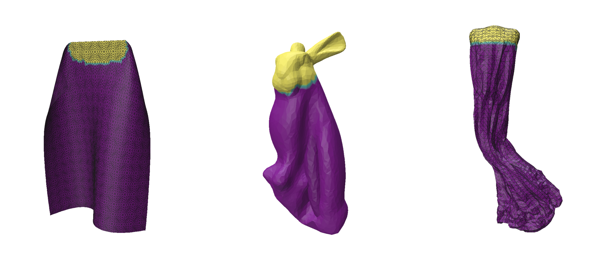

# Real-time Cloth Simulation Using Projective Dynamics 



I've implemented a real-time cloth solver using projective dynamic[^1] and discrete quadratic bending energy[^2]. User can drag the cloth via custom handle and play around with different simulation parameters. Collision is not implemented since proper cloth self collision is *really* hard and I just run out of time. 

## Compile From Source

To compile the project from source, you need to install `cmake` and a cmake generator like `make` or `ninja`.

In addition, make sure your compiler of choice support C++20. Please refer to the table below.

| compiler | recommend version |
| -------- | ----------------- |
| gcc      | >= 12             |
| clang    | >= 12             |
| msvc     | >= 19.29          |

To compile, go the the root directory,

```
cmake --preset Release
cmake --build build/release
# limit the job num if you run out of memory
cmake --build build/release -j 2
```

That's it! The binary is located at `build/release/main`.

## Usage Guide


### 1 Getting Started

1.  **Launch the Application:** Run the compiled executable directly. Optionally, you can pass in the path of a model file as cli arg.
2.  **Load a Mesh:** Click the "Load Model" button in the Load Mesh panel.

I've provide some default model in the `data` directory. 

### 2 Paint The Handle

To create a handle that can be used later in cloth simulation, you need to use paint mode to select vertices.

Click the "Start Painting" button to enter paint mode. In paint mode, **left click to paint** and **right click to erase**. When you are finished, click the "Stop Painting" button.

### 3 Cloth Simulation

After adjusting simulation parameters, click the "Start Simulation" button to enter simulation mode. In simulation mode, you can drag the handle by **holding Control + left clicking**.

Below are a quick table for all simulation parameters.

| Parameter         | Description                                                  | Recommend Value |
| ----------------- | ------------------------------------------------------------ | --------------- |
| Solver Thread     | Number of thread the solver will use. Since the app is cache bound, setting it too high will degrade the performance. | 4 - 8           |
| Target FPS        | The internal fps of solver. High stiffness requires high fps. | 180 - 540       |
| Elastic Stiffness | The membrane stiffness of the cloth. You typically want this to be super high. | 1000 - 10000    |
| Bending Stiffness | The bending stiffness of the cloth.                          | 0.01 - 10       |
| Density           | The density of the cloth.                                    | 0.1 - 1         |
| Gravity           | The gravitational acceleration.                              | 10 - 50         |

## Technical Detail

### Theoretical Background - Journey to Projective dynamic

Initially, I intended to adopt position-based techniques such as XPBD. However, during my research, I came across the paper *Discrete Quadratic Curvature Energies*,  which demonstrated that bending energy can be effectively approximated using a bi-Laplacian term[^1]. 

Then a thought immediately struck me. **Wait a moment... Can I somehow simplify elastic energy to quadratic form so the system can be solved in one step? **

This motivated me to explore alternative real-time method which eventually led to **Projective Dynamics**[^2]. The gist of it is that if the distance form the current configuration to the rest configuration is small enough, we can approximate any complex energy as quadratic. Combining this with quadratic bending energy, the whole system energy becomes quadratic. This is the method SOTA cloth model use. 

The simulation pipeline becomes:

1. Solving projection (closest rest configuration) locally. Trivially parallelized.
2. Solving global system via a single sparse linear solve.

### Software Stack

**Numerical**

- `libigl`
- `eigen`

**UI**

- `polyscope`
- `portable-file-dialogs`

**Others**

- `spdlog`
- `openmp`

### What is missing and what I've learned

Solving the cloth physics itself is just a small part of the story. Apart from the cloth model itself, there's damping, friction, and **collision**. Oh god, resolving cloth self collision is ***difficult***. To resolve collision accurately while maintaining some level of performance, SOTA method[^3][^4] [^5]often 

- use some sort of level-of-detail algorithm to reduce geometry
- space partitioning/hashing algorithm to query potential collision 
- continuous collision detection
- contact force resolution
- all of above with GPU parallelization

In a nutshell, cloth simulation is an active and difficult research field in computer graphics.  Even just aiming  for visually convincing simulation requires multiple complex algorithm and huge engineering effort. 

Despite only implementing a small part of the simulation pipeline, I’ve learned a lot about physical simulation, numerical methods, and optimization techniques. After this project, I've obtained a rough view of the cloth and physics based simulation landscape.

## Thank you 

I would like to sincerely thank Professor Daniele and all the TAs for this outstanding course. It is exceptionally well-designed, featuring interactive demos and a well-structured curriculum that introduces many fundamental concepts and algorithms in computer graphics. After completing this course, I had a much easier time reading graphics papers, thanks to the solid foundation this course provided.

## References

[^1]: S. Bouaziz, S. Martin, T. Liu, L. Kavan, and M. Pauly, “Projective dynamics: fusing constraint projections for fast simulation,” *ACM Trans. Graph.*, vol. 33, no. 4, p. 154:1-154:11, Jul. 2014, doi: [10.1145/2601097.2601116](https://doi.org/10.1145/2601097.2601116). 
[^2]: M. Wardetzky, M. Bergou, D. Harmon, D. Zorin, and E. Grinspun, “Discrete quadratic curvature energies,” *Computer Aided Geometric Design*, vol. 24, no. 8, pp. 499–518, Nov. 2007, doi: [10.1016/j.cagd.2007.07.006](https://doi.org/10.1016/j.cagd.2007.07.006).
[^3]:M. Tang,  tongtong wang, Z. Liu, R. Tong, and D. Manocha, “I-cloth: incremental collision handling for GPU-based interactive cloth simulation,” *ACM Trans. Graph.*, vol. 37, no. 6, p. 204:1-204:10, Dec. 2018, doi: [10.1145/3272127.3275005](https://doi.org/10.1145/3272127.3275005).
[^4]:R. Bridson, R. Fedkiw, and J. Anderson, “Robust treatment of collisions, contact and friction for cloth animation,” *ACM Trans. Graph.*, vol. 21, no. 3, pp. 594–603, Jul. 2002, doi: [10.1145/566654.566623](https://doi.org/10.1145/566654.566623).
[^5]:X. Li *et al.*, “Subspace-Preconditioned GPU Projective Dynamics with Contact for Cloth Simulation,” in *SIGGRAPH Asia 2023 Conference Papers*, in SA ’23. New York, NY, USA: Association for Computing Machinery, Dec. 2023, pp. 1–12. doi: [10.1145/3610548.3618157](https://doi.org/10.1145/3610548.3618157).
