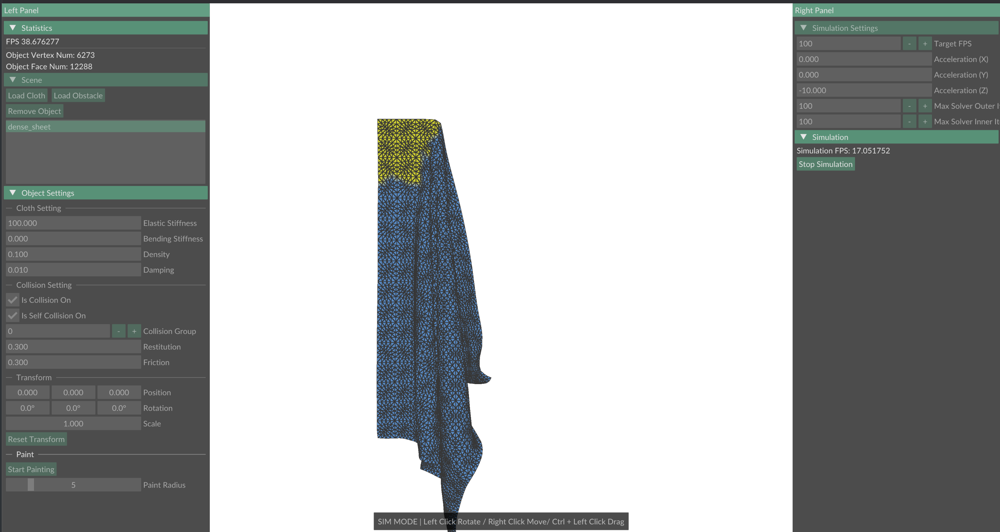

WIP C++17 physics engine with

- A working cloth simulation with an efficient collision pipeline
- A (still incomplete) GUI demo

## Quick start

### Prerequisite

- a c++17 compiler (gcc >= 9.1, clang >= 7.0, or msvc >= VS 2019)
- `cmake` and a generator like `make` or `ninja`
- `git`
- BLAS and LAPCK. I recommend [OpenBlas](https://github.com/OpenMathLib/OpenBLAS) for ease of install.

### Installing BLAS and LAPACK

#### Linux

```bash
# ubuntu
sudo apt install libopenblas-dev
# fedora
sudo dnf install openblas-devel
```

#### MacOS

```bash
brew install openblas
```

#### Windows

WIP

### Build and run the demo

First clone the repo and its submodules.

```bash
git clone https://github.com/iiiian/silk_physics.git
git submodule update --init --recursive
```

Configure and build.

```bash
cd silk_physics
cmake --preset release
cmake --build build/release --target demo
```

Run the demo.

```bash
./build/release/demo/demo ./model/dense_sheet.obj
```
